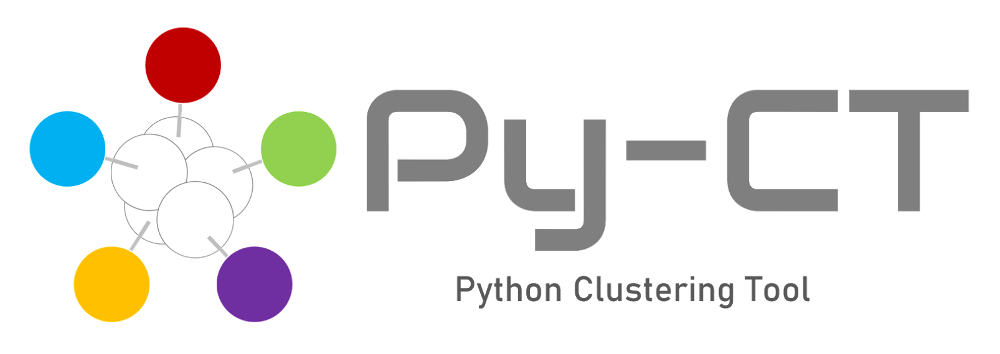

<!--  -->

## Overview
File Sort Toolはデータファイルの整理を行うツールです。参照データと入力データの類似度に基づいてmatch/mismatchに整理することができます。
ロギングデータの中から欲しいデータ（に近いもの）を抽出したいときに使えるツールを目指しています。

The File Sort Tool is a tool for organizing data files.
It can sort data files into matches/mismatches based on the similarity between reference and input data.
It is a tool that can be used when you want to extract desired data (or something close to it) from logging data.

## Features

### Sort Method
[Dynamic Time Warping(DTW)](https://zenn.dev/kinonotofu/articles/a7cb8038bb2433#dynamic-time-warping%EF%BC%88dtw%E3%80%81%E5%8B%95%E7%9A%84%E6%99%82%E9%96%93%E4%BC%B8%E7%B8%AE%E6%B3%95%EF%BC%89)を用いてデータの類似度を算出しています。  
DTWとは時系列データ同士の距離・類似度を測る際に用いる手法です。
２つの時系列の各点の距離(誤差の絶対値)を総当たりで求め、全て求めた上で２つの時系列が最短となるパスを見つけます。
時系列同士の長さや周期が違っても類似度を求めることができます。

## Requirement

```bash
pip install -r requirements.txt
```

## Usage

### Run Py-CT

```bash
python .\scripts\main.py 
```

### Pyinstaller

```bash
pyinstaller .\main.spec --clean --noconfirm
```

## Reference

- [telearnを使って気象データをクラスタリングしてみる](https://zenn.dev/kinonotofu/articles/a7cb8038bb2433#dynamic-time-warping%EF%BC%88dtw%E3%80%81%E5%8B%95%E7%9A%84%E6%99%82%E9%96%93%E4%BC%B8%E7%B8%AE%E6%B3%95%EF%BC%89)
- [Pythonの機械学習ライブラリtslearnを使った時系列データのクラスタリング](https://blog.brains-tech.co.jp/tslearn-time-series-clustering)
- [DTW(Dynamic Time Warping)動的時間伸縮法](https://data-analysis-stats.jp/%e6%a9%9f%e6%a2%b0%e5%ad%a6%e7%bf%92/dtwdynamic-time-warping%e5%8b%95%e7%9a%84%e6%99%82%e9%96%93%e4%bc%b8%e7%b8%ae%e6%b3%95/)
- [ICOファイル作成](https://ao-system.net/multiicon/)
